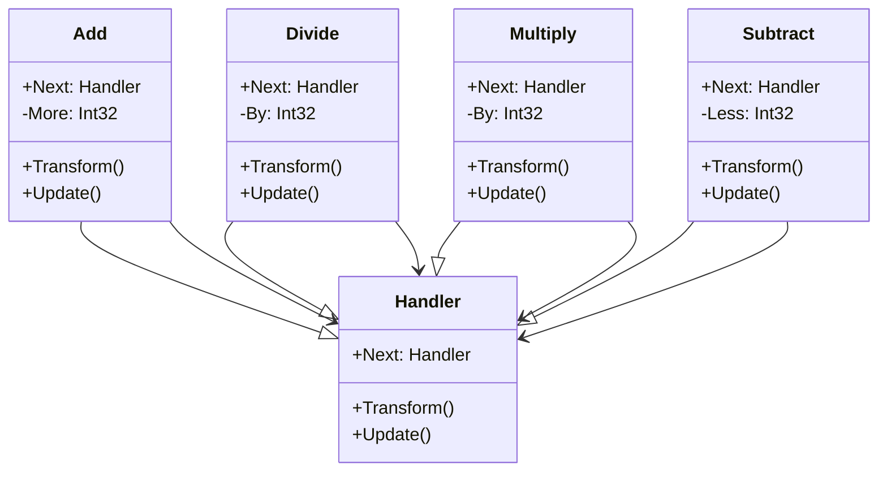

# Chain of Responsibility

## Description

Chain of Responsibility is a behavioural design pattern 
that lets you pass requests along a chain of handlers. 
Upon receiving a request, each handler decides either 
to process the request or to pass it to the next 
handler in the chain.

## Scenario

We take a number and perform a series of simple 
mathematical operations. Each subsequent operation
takes the result of the previous and produces 
a number as a result. The order in which the 
operations are performed is determined by the caller.

## Implementation

