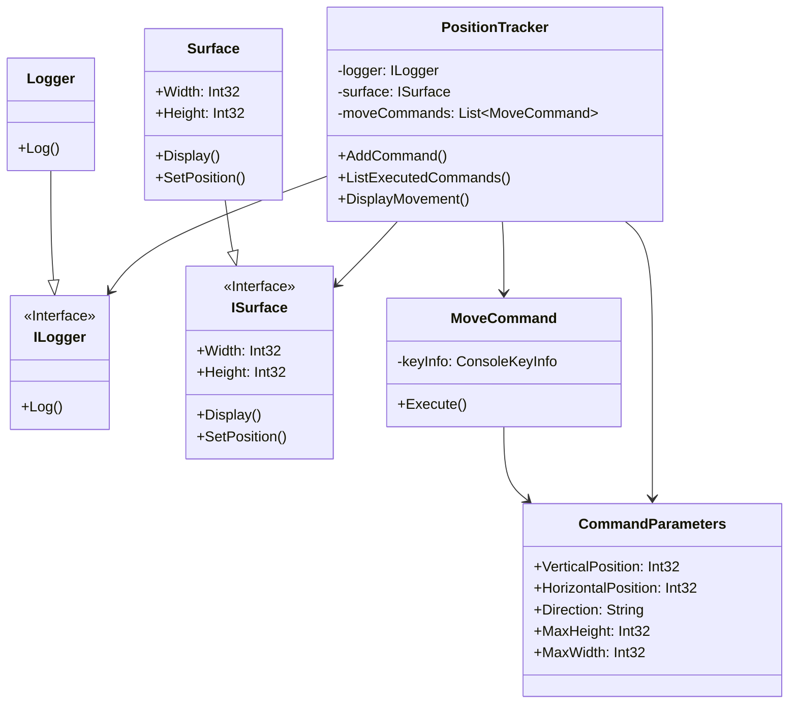

# Command

## Description

The Command Pattern is a behavioural design pattern 
that turns a request into a stand-alone object 
containing all the information needed to execute 
the request.

## Scenario

The user moves the cursor around the screen using the
arrow keys. Each move is encapsulated into a 
MoveCommand object and stored into a collection inside 
the PositionTracker.
When finished the list of the executed commands 
is retrieved and presented on the screen in
order of their execution.

## Implementation

