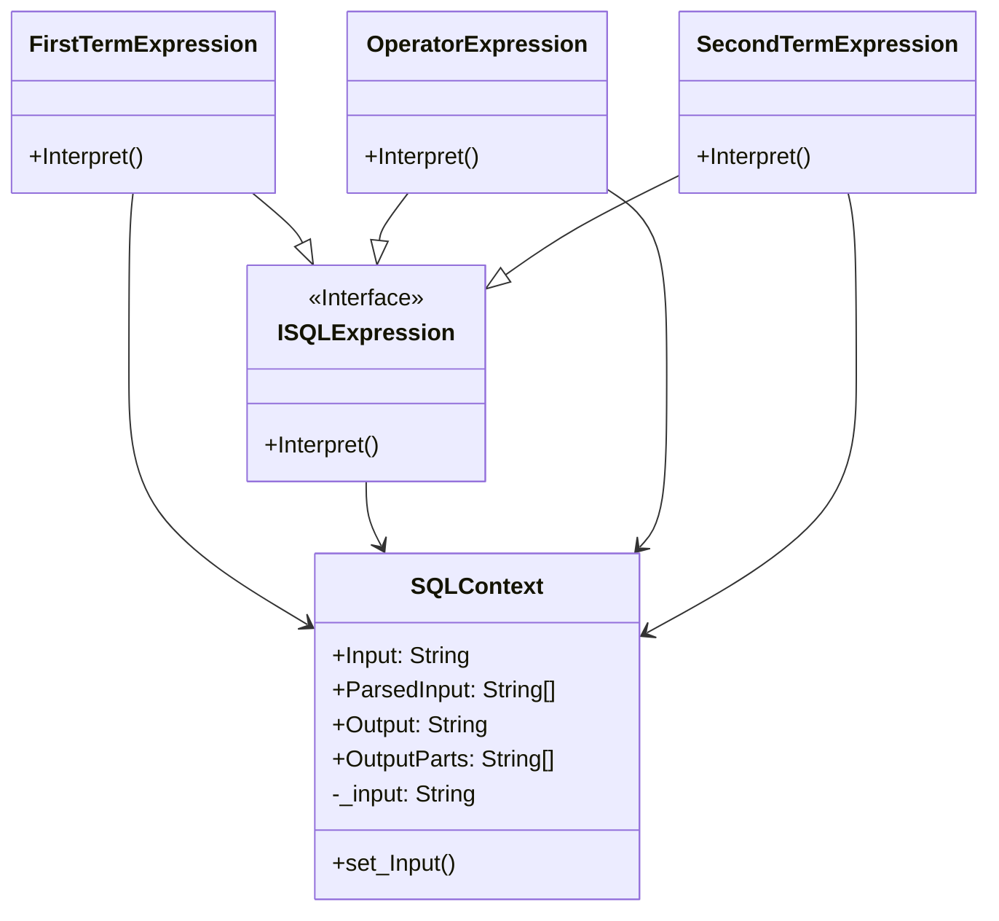

# Interpreter

## Description

The Interpreter pattern, a behavioural design pattern, 
provides a way to define a grammatical representation 
for a language and an interpreter to interpret 
sentences in that language. 

## Scenario

We start with a simple three-word phrase in English
and wish to query a database, retrieving data relevent
to the entered phrase.
We process each of the words and form an SQL query,
which, when executed, will produce the desired result..

## Implementation

