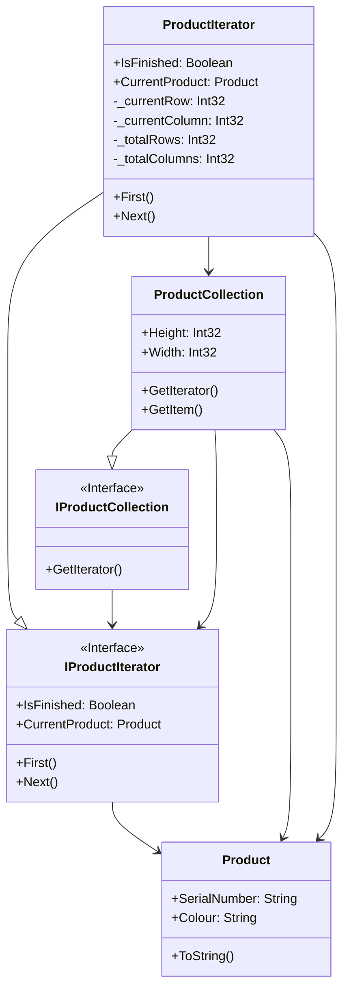

# Iterator

## Description

The Iterator design pattern is a behavioural design 
pattern that provides a way to access the elements 
of an aggregate object (like a list) sequentially.

## Scenario

Given a two-dimensional matrix with product data we
print on the screen a simple, one-dimensional list
of all the products.

## Implementation

