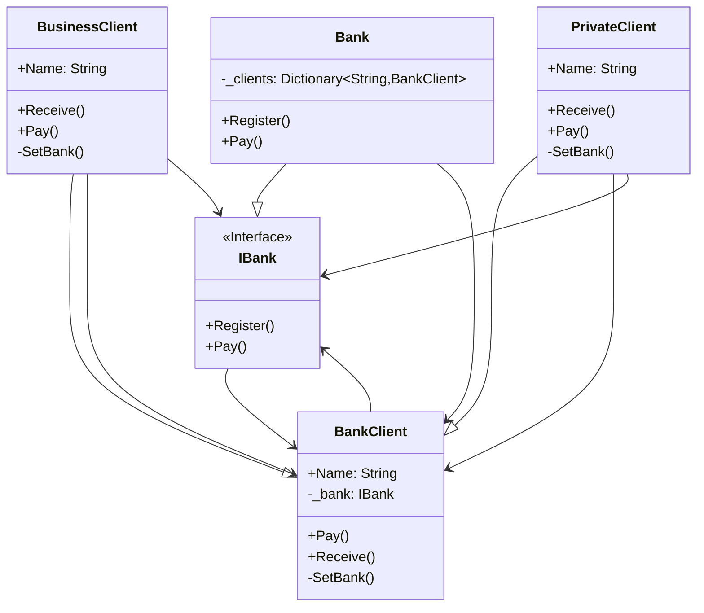

# Mediator

## Description

The Mediator pattern is a behavioural design pattern 
that reduces coupling between objects by centralising 
their communication through a single mediator object. 
Instead of objects directly referencing and interacting 
with each other, they communicate indirectly through 
the mediator, which manages the interaction logic. 
This promotes loose coupling, making the system more 
flexible, maintainable, and reusable. 

## Scenario

A bank has a number of clients - some are individuals
and some are business clients. Some clients pay money
to other clients - purchases, salaries, etc. In all 
those transaction the bank serves as a mediator.

## Implementation

