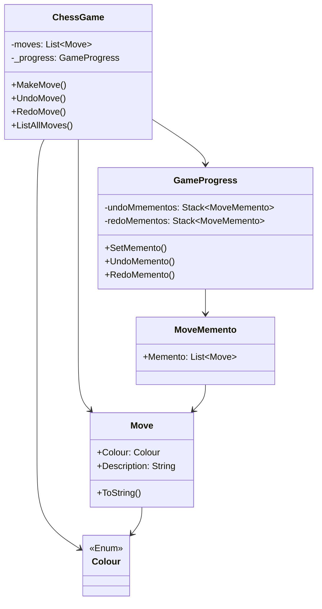

# Memento

## Description

Memento is a behavioural design pattern that lets you 
save and restore the previous state of an object 
without revealing the details of its implementation.

## Scenario

In a game of chess, both the white and the black make 
moves. With the help of the MoveMemento class we are
able to easily undo or redo a move.

## Implementation

