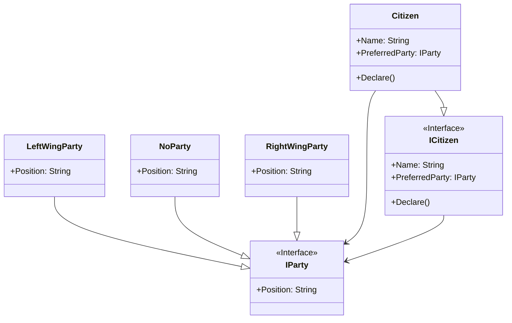

# Null Object

## Description

The Null Object pattern, a behavioural design pattern, 
replaces the need for null references with a concrete 
object that provides default or "do-nothing" behavior.
Instead of checking for null before interacting with 
an object, you can interact with the null object, 
which handles the absence of the intended object 
gracefully. 
This simplifies code, reduces null pointer exceptions, 
and promotes cleaner, more maintainable code. 

## Scenario

A group of citizens declare their voting preferences.

A citizen may or may not have a favourite party.
If a citizen has a favourable party, the declaration
consists of the party position.

We could have set the PreferedParty to null for each
citizen who does not have a favourite party.
Instead, we've created the No Party class, avoiding
the use of null checks and reducing the chance of error.

## Implementation

