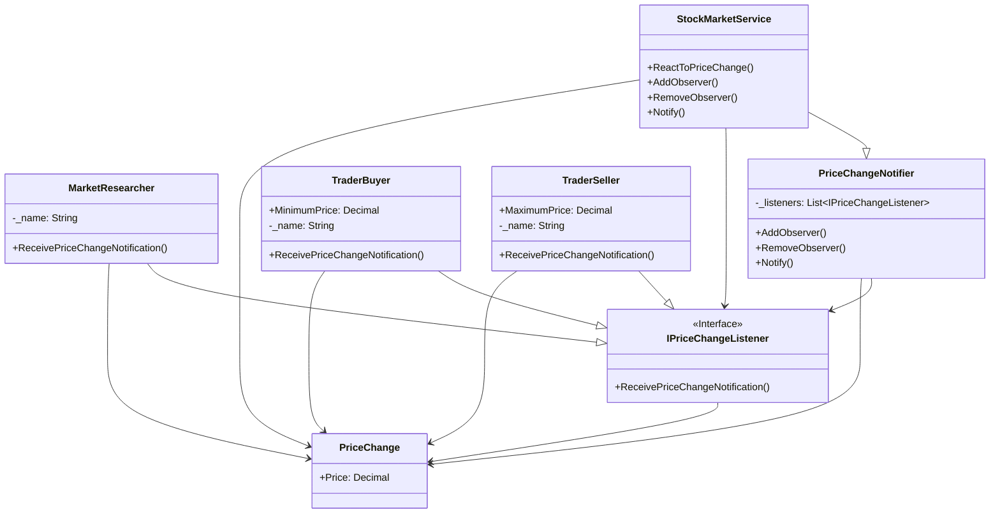

# Observer

## Description

Observer pattern is used when there is a one-to-many 
relationship between objects such as if one object 
is modified, its dependent objects are to be notified 
automatically.  The observer pattern falls under 
behavioural pattern category.

## Scenario

In the stock market many players need to be notified
when the price of a stock changes. In our scenario
there are a buyer, a seller, and a market researcher.
The players dynamically subscribe to or unsubscribe
from the service that notifies of price changes.
Only those who are subscribed receive notifications.

## Implementation

