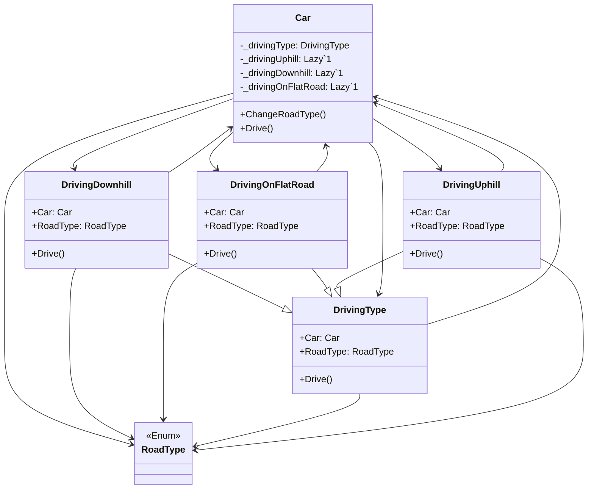

# State

## Description

State is a behavioral design pattern that lets an 
object alters its behaviour when its internal state 
changes. It appears as if the object changed its class.

## Scenario

We have a car that is being driven. Depending on
whether you go uphill or downhill, you need to either
add gas or tap the brakes. The slope of the road in
our case corresponds to the internal state.

## Implementation

