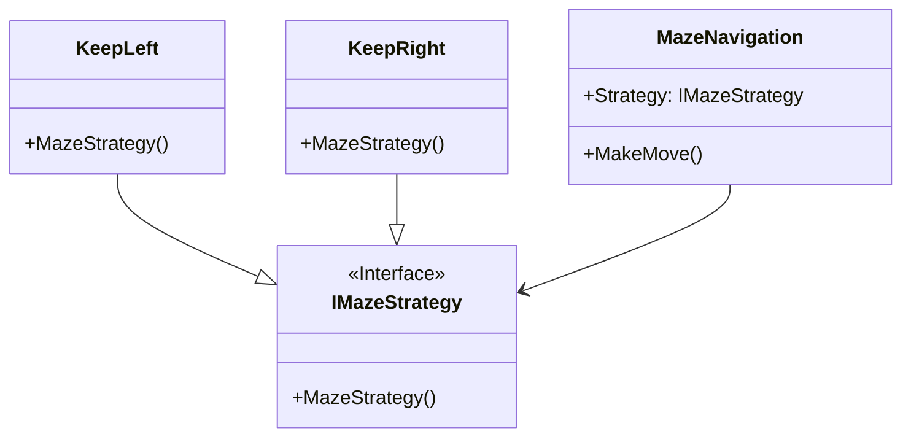

# Strategy

## Description

The Strategy Design Pattern defines a family of 
algorithms, encapsulates each one, and makes them 
interchangeable, allowing clients to switch 
algorithms dynamically without altering the code 
structure.

## Scenario

We are trying to find our way out of a maze. The two
most popular ways to achieve this goal are to stick
to the wall on the left-hand side or to the one on 
the right-hand side. We can have a number of players
using the MazeNavigation class. By assigning or 
dynamically changing the players MazeNavigation Strategy
we control how the player will try to get out of the maze.

## Implementation

