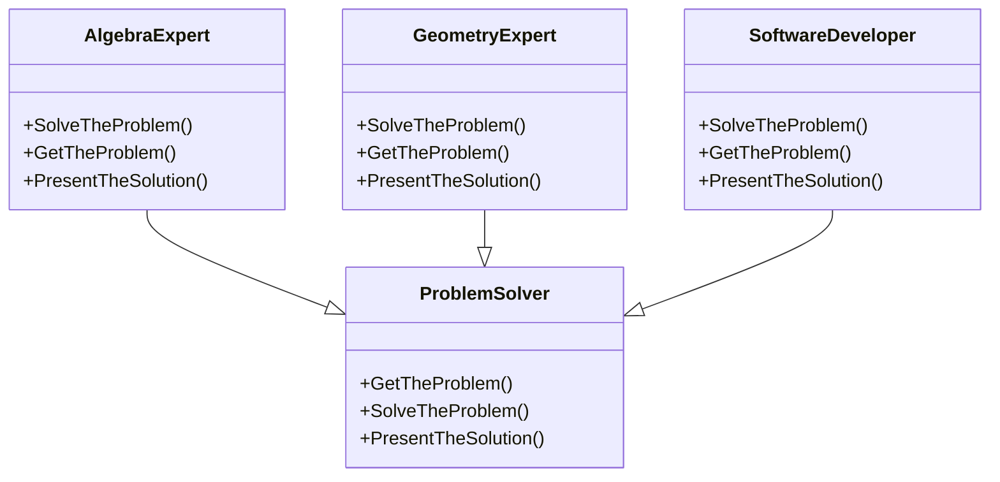

# Template Method

## Description

The template method is a method in a superclass, 
usually an abstract superclass, and defines the 
skeleton of an operation in terms of a number of 
high-level steps.

## Scenario

We have three problem solver experts. One specialises
in Algebra, another - in Geometry, and the third one -
in Software Development. The boss asks each of them, 
using exactly the same words, to solve a problem and 
each expert solves the problem using its unique set of
skills.

## Implementation

