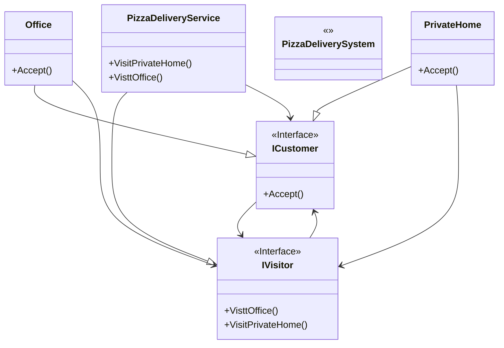

# Visitor

## Description

The Visitor design pattern is a behavioural pattern 
that allows you to add new operations to a group of 
related classes without modifying their structures.

## Scenario

Our visitor is a pizza delivery person. Two orders have
been received - from an office and from a private home.
Clients from both addresses can enjoy their pizzas.
after the visitor finishes the deliveries.

## Implementation

