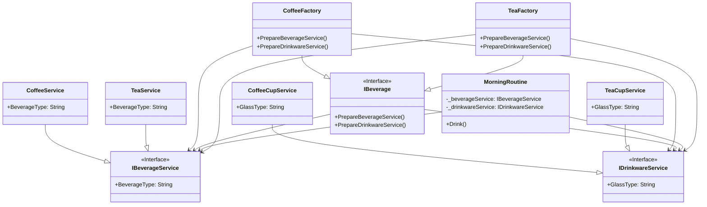

# Abstract Factory

## Description

The Abstract Factory Pattern is a way of organising 
how you create groups of things that are related to 
each other.

## Scenario

My morning routine includes drinking either tea or 
coffee. I have both tea and coffee cups, but I don't
want to drink my tea from a coffee cup or vice versa.
Therefore, when I model my morning routine I 
instantiate either the TeaFactory or the CoffeeFactory.
The factory that I choose makes sure that the beverage
is served in the appropriate cup.

## Implementation

