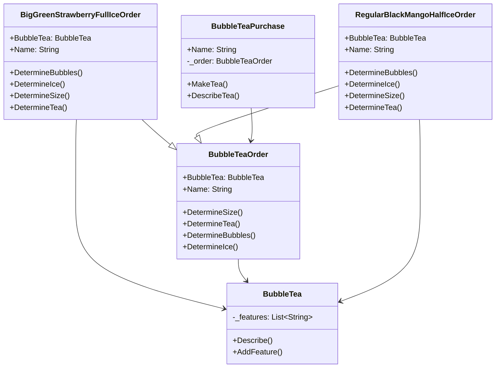

# Builder

## Description

The builder pattern is a creational design pattern 
that allows for the step-by-step creation of complex 
objects.

## Scenario

We are running a bubble tea shop. The customers have
different preferences - what cup size, what tea,
what bubbles and how much ice, but the procedure of
preparing the product is the same. We have a couple 
of clases with favourite combinations, both
inheriting from BubbleTeaOrder and use them when an
order is placed.

## Implementation

