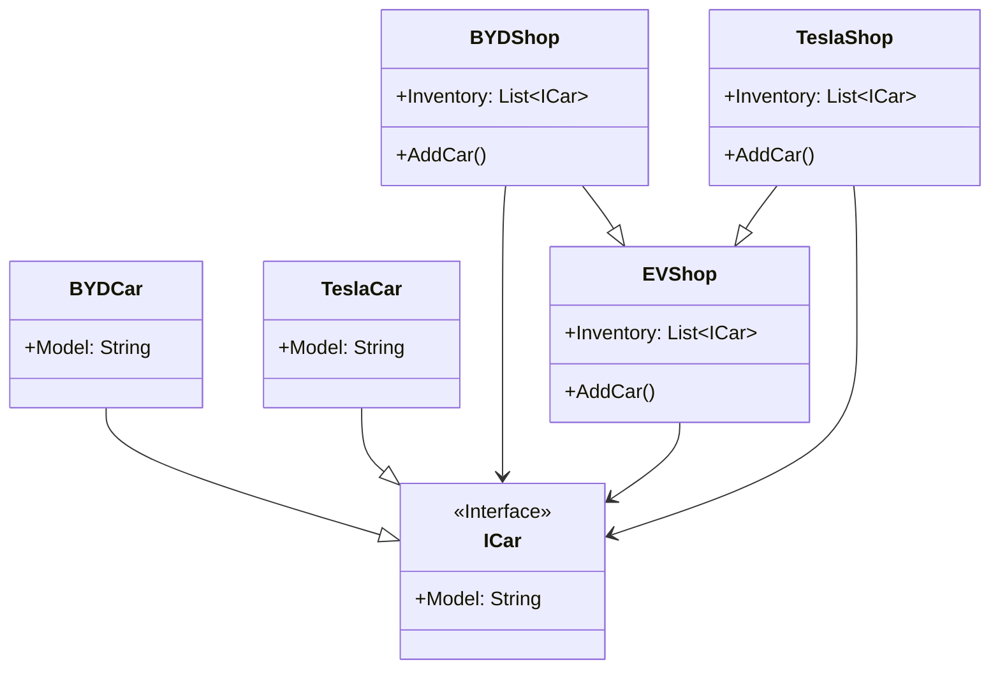

# Factory Method

## Description

The factory method pattern is a creational design 
pattern that provides an interface for creating 
objects but allows subclasses to decide which 
class to instantiate. 
It's a way to create objects without specifying 
the exact class to be created, deferring that 
decision to subclasses. 

## Scenario

We have two EV shops - one Tesla and one BYD. Obviously
Tesla will not sell BYD cars and vice versa.
Therefore, customers buy only Tesla cars from the
Tesla shop and only BYD cars from the BYD shop and
this is modelled using the Factory Method pattern.

## Implementation

