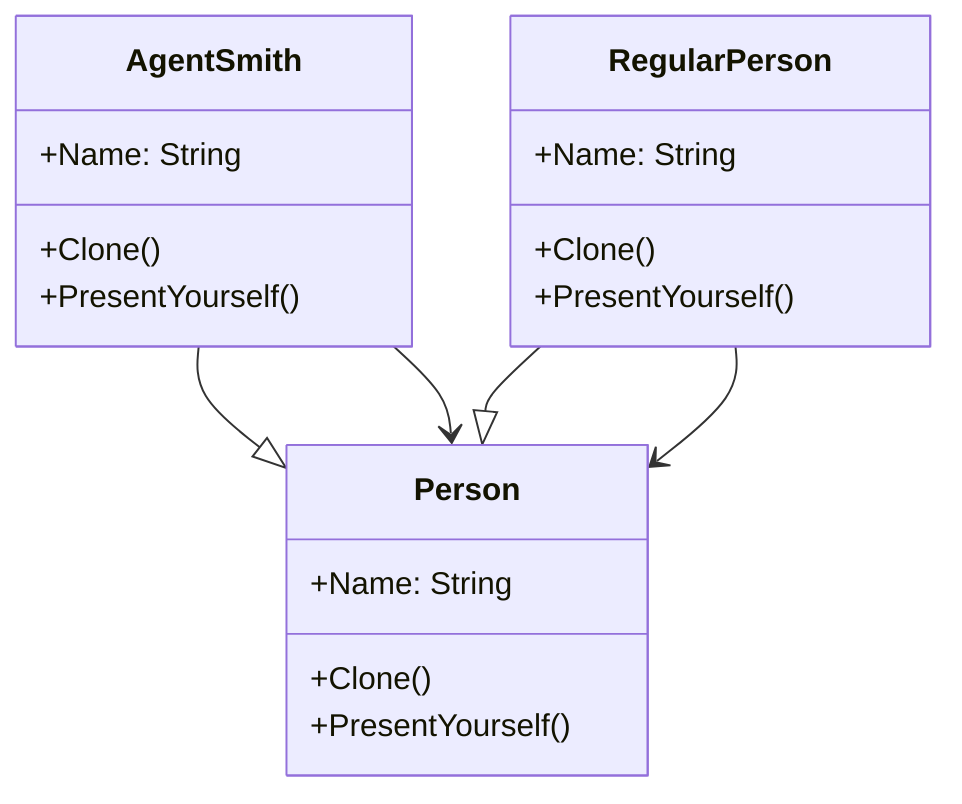

# Prototype

## Description

The prototype pattern is a creational design pattern 
that allows you to create new objects by cloning an 
existing object, rather than creating them from scratch. 
This is particularly useful when object creation is 
resource-intensive or when you need to create many 
similar objects with slight variations. 

## Scenario

There are several variations of this pattern. The one
illustrated here is the most basic one, using only a
shallow copy.

We are inside the Matrix. There are a couple of regular
individuals and multiple copies of Agent Smith. The
instants of Agent Smith are obtained by cloning a 
prototype.

## Implementation

