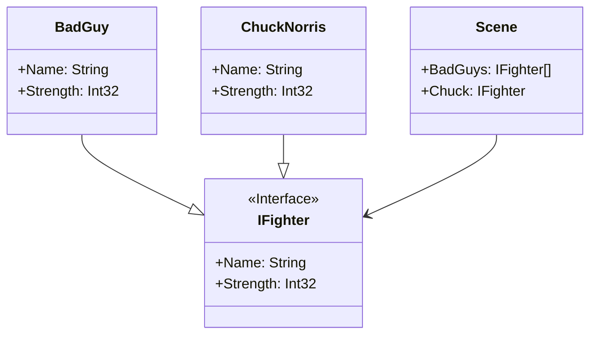

# Singleton

## Description

The Singleton pattern is a creational design pattern 
that restricts the instantiation of a class to a 
single instance and provides a global access point 
to that instance. 
This ensures that only one object of a specific class 
exists throughout the application's lifetime. 

## Scenario

We are shooting an action movie starring Chuck Norris.

There are a number of scenes in which our hero 
inevitably defeats the bad guys. In each scene there
are a number of vilians, but like every sane person
on the planet knows there can be only one Chuck Norris!

## Implementation

