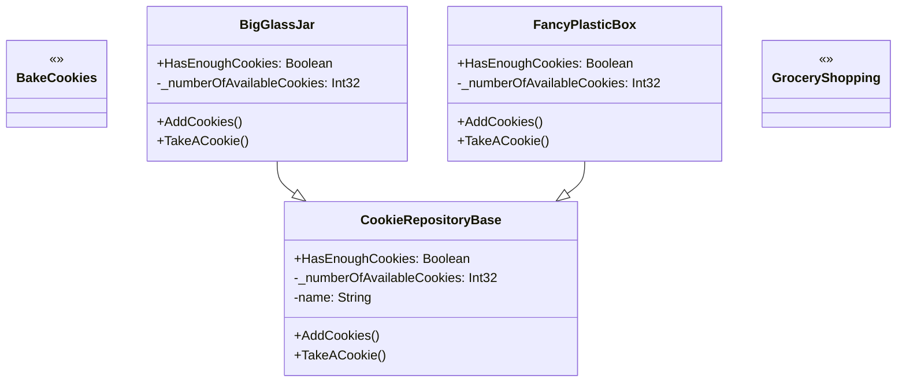

# Repository

## Description

The Repository pattern is a design pattern that provides an 
abstraction layer between the application's data access logic 
and the underlying data source (like a database). It acts as 
an intermediary, centralizing data access operations and 
decoupling the domain model from the specific data storage 
implementation. 
This promotes better maintainability, testability, and 
flexibility in application development. 

## Scenario

We like cookies. We can buy them either from the shop, or bake
them ourselves. We can store them in different places, like
that big glass jar in the kitchen. The beauty of the pattern
is that when we take a cookie from the jar we don't really
care whether it came from the shop or from the oven.

## Implementation

