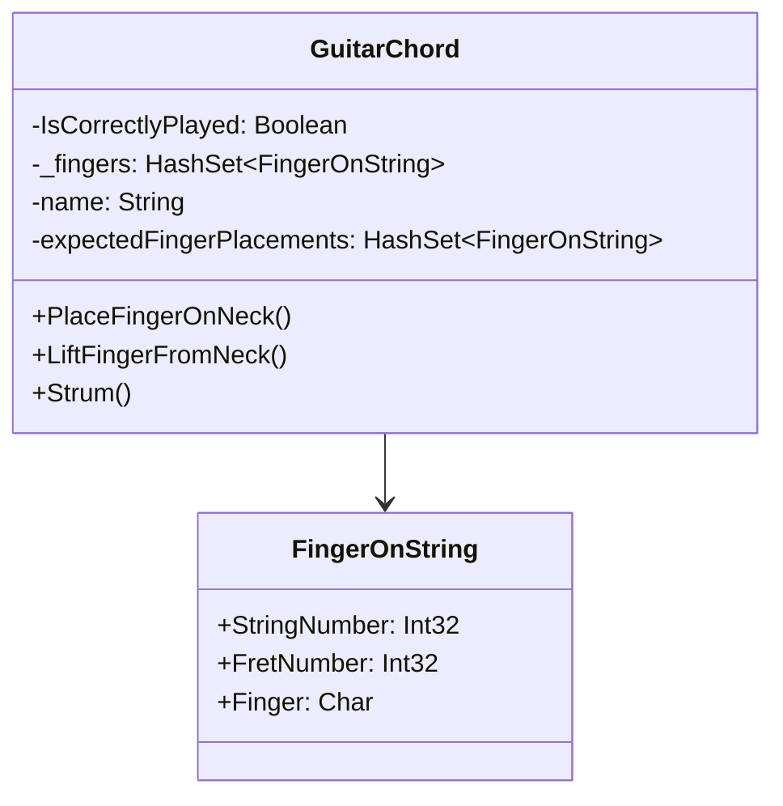

# Unit of Work

## Description

The Unit of Work pattern is a design pattern in software
development that focuses on managing a group of operations 
as a single, atomic transaction. 
It ensures data consistency and integrity by treating a set
of related changes to a data store as a cohesive unit. 

## Scenario

We are playing guitar chords. To play a chord properly, fingers
of one hand must press specific strings at specific locations.
The chord sounds well only if the correct strings are pressed
by the correct fingers at the correct locations, all at the
same time

## Implementation

