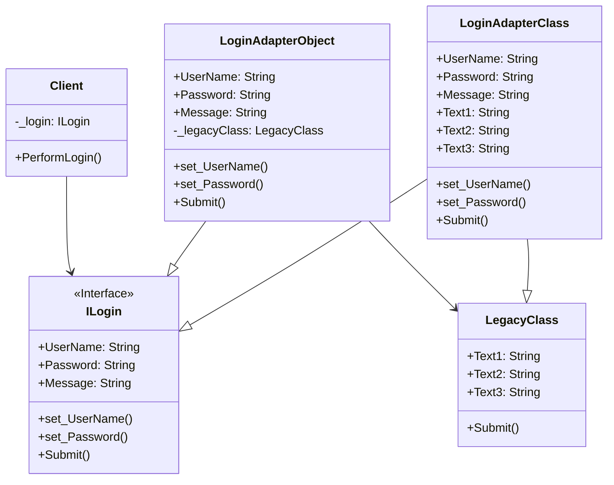

# Adaptor

## Description

Adaptor (Adapter) is a structural design pattern that 
allows objects with incompatible interfaces to 
collaborate.

## Scenario

We have a legacy class allowing us to log in to a third
party system. The class exposes properties that do not 
match the standards of our current system. We use an
adaptor that connects to the legacy code and exposes
interface matching the standards of our system.

## Implementation

Two variants of the pattern have been implemented:

    - The object variant, accepting the legacy class object as a parameter
    - The class variant, inheriting from the legacy class

