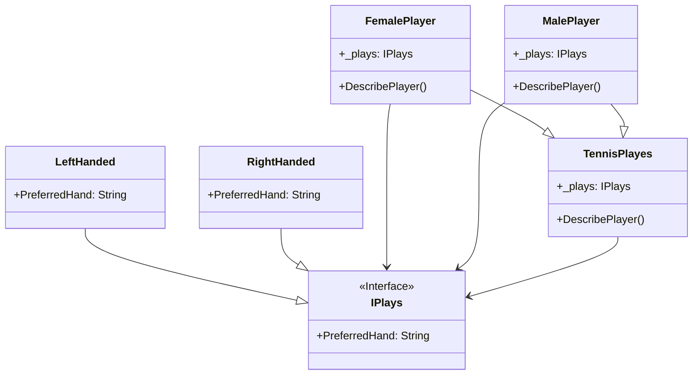

# Bridge

## Description

The Bridge Design Pattern decouples abstraction from 
implementation, allowing for flexible combination of 
e.g., shapes and colours, without creating new classes.

## Scenario

We describe the participants in a tennis tournament.
There are both male and female players. Some of them are
right-handed and some left-handed. We don't wish to
create a separate class for each combination because
we plan to add many other categories, and with this 
approach, it will soon be very difficult to manage the
project.

## Implementation

