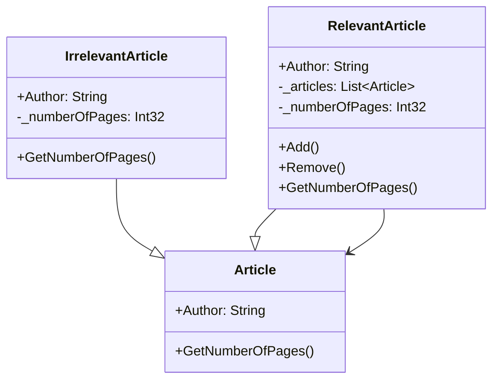

# Composite

## Description

The composite pattern is a structural design pattern 
that allows you to compose objects into tree-like 
structures to represent part-whole hierarchies. 
This enables clients to treat individual objects 
and compositions of objects uniformly.

## Scenario

As part of a research project, a scientist must carefully
examine a number of existing papers. Normally a
research paper contains references to other papers.
The scientist must identify the relevant papers, locate
them and examine them too. The process must continue
until no more references to relevant articles are found.

## Implementation

