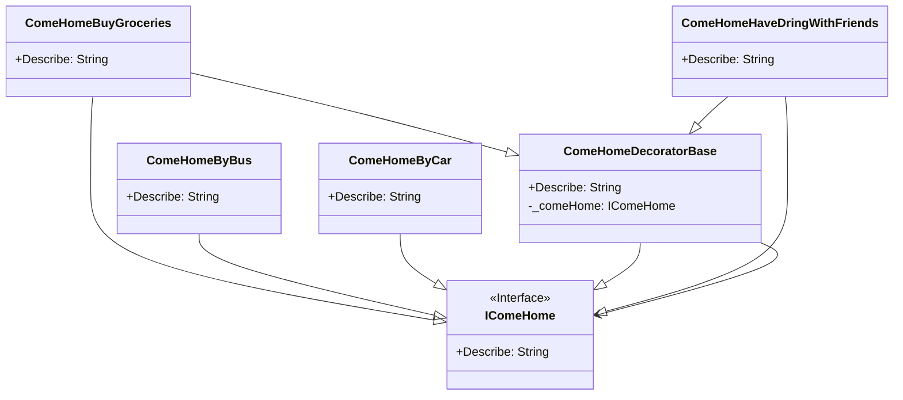

# Decorator

## Description

Decorator is a structural design pattern that lets you 
attach new behaviours to objects by placing these objects 
inside special wrapper objects that contain the behaviours.

## Scenario

A person goes home after work either by car or by bus.
Some days the person needs to buy groceries; at others - 
meet with friends. We wrap the specific ComeHome objects,
adding the additional behaviour of buying groceries or
having a drink with friends.

## Implementation

