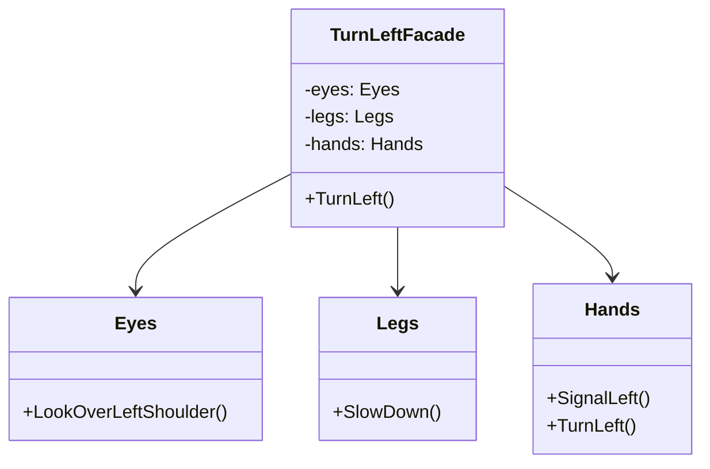

# Facade

## Description

The facade pattern is a software design pattern commonly 
used in object-oriented programming. Analogous to a 
façade in architecture, it is an object that serves 
as a front-facing interface masking more complex 
underlying or structural code.

## Scenario

We are driving a car. The process requires our eyes,
hands and legs to work in sync. A simple turn
involves each of those subsystems, and we wish to be able 
to react to an instruction to, say, make a left turn, 
without thinking specifically about what each of them needs
to do.

## Implementation

