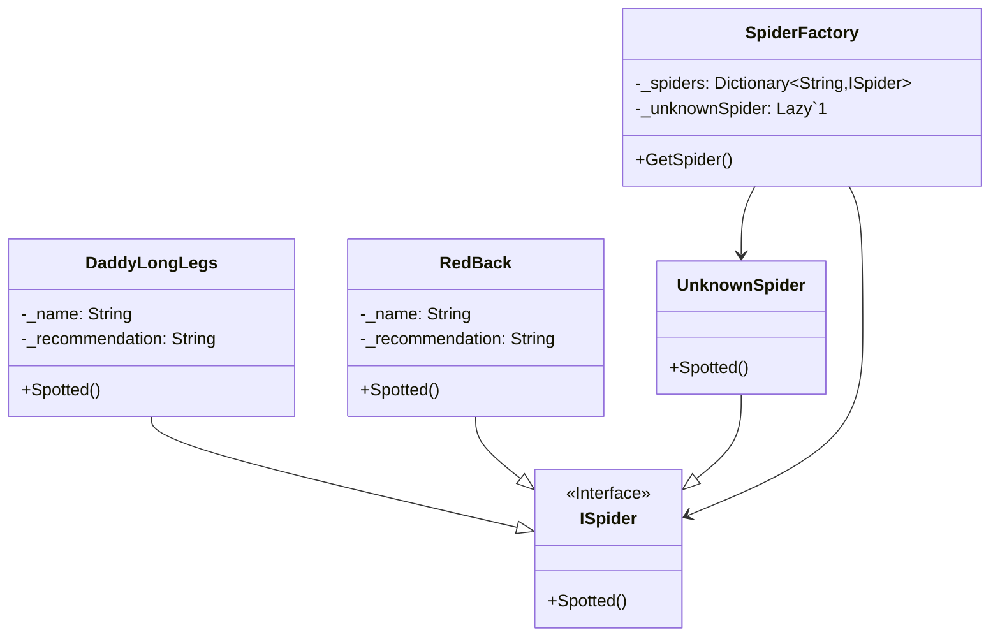

# Flyweight

## Description

The flyweight pattern is a structural design pattern 
that minimises memory usage and/or computational 
expenses by sharing as much as possible with related 
objects. 
It's particularly useful when dealing with a large 
number of objects, each having some amount of similar 
or identical data. The pattern achieves this by 
separating the intrinsic (shared, unchanging) state 
from the extrinsic (unique, changing) state of an object. 

## Scenario

We are inspecting our property for spiders. We find many
spiders, but they are only from one of two types. Since
all spiders of the same type share properties and need
to be treated in the same way, we create only one object
for each type of spider and then reuse it.

## Implementation

