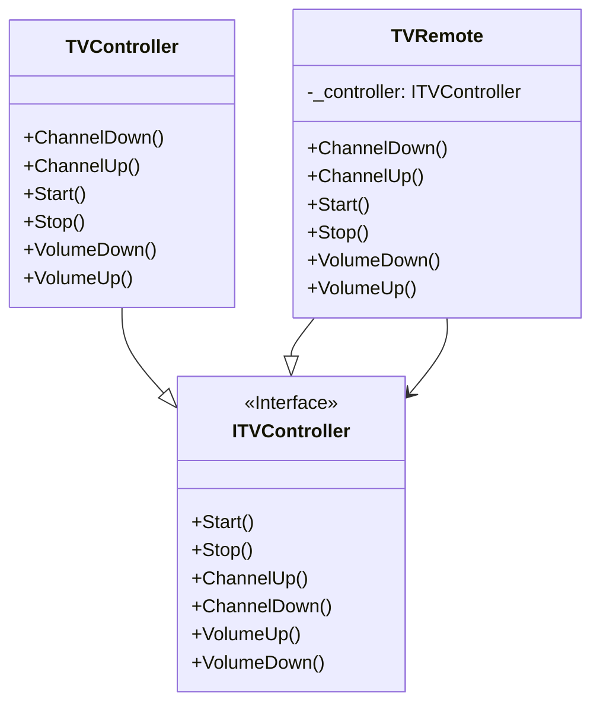

# Proxy

## Description

The proxy pattern is a structural design pattern that 
provides a placeholder (proxy) for another object to 
control access to it. It acts as an intermediary, 
adding additional functionality or controlling 
access to the original object, without the client 
knowing it's interacting with a proxy. 

## Scenario

While watching TV at home, we are using a remote. Instead
of walking up to the TV every time we wish to change
something, we use thebuttons of the remote.

## Implementation

